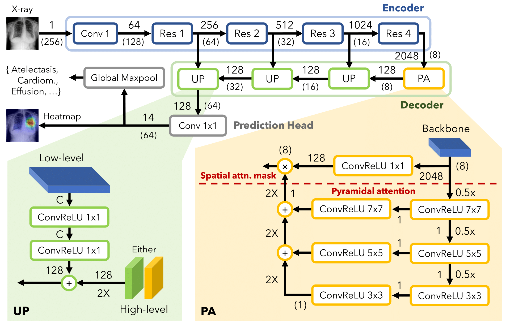

# Official implementation of Pyramid Localization Network (PYLON)

From the paper, "High resolution weakly supervised localization architectures for medical images". [(Preprint)](https://arxiv.org/abs/2010.11475)

**High accuracy localization:**


**PYLON's architecture:**


## What's included

- Pytorch implementation of PYLON
    * [Pretrained weights](https://drive.google.com/file/d/1v26dU21hjePidW5crSXsrpf3OCJWLoWp/view?usp=sharing)
- Additional results and heatmaps 
- Code to reproduce the main results

## Additional results

1. [Picked localization images (256 x 256)](figs/picked/bs64_nih14_256min0.7-rot90p0.5-bc(0.5,0.5)-cubic) (~20)

    * [PYLON](figs/picked/bs64_nih14_256min0.7-rot90p0.5-bc(0.5%2C0.5)-cubic/pylon-resnet50-uptype2layer-imagenet-dec128_lr0.0001term1e-06rop1fac0.2_fp16/0)
    * [Backbone](figs/picked/bs64_nih14_256min0.7-rot90p0.5-bc(0.5%2C0.5)-cubic/baseline-resnet50-maxpool-imagenet_lr0.0001term1e-06rop1fac0.2_fp16/0)
    * [DeeplabV3+](figs/picked/bs64_nih14_256min0.7-rot90p0.5-bc(0.5%2C0.5)-cubic/deeplabv3+-resnet50-dec256-imagenet_lr0.0001term1e-06rop1fac0.2_fp16/0)
    * [DeeplabV3+ (No GAP)](figs/picked/bs64_nih14_256min0.7-rot90p0.5-bc(0.5%2C0.5)-cubic/deeplabv3+-resnet50-dec256-nogap-imagenet_lr0.0001term1e-06rop1fac0.2_fp16/0)
    * [FPN (BN)](figs/picked/bs64_nih14_256min0.7-rot90p0.5-bc(0.5%2C0.5)-cubic/fpn-resnet50-py256dec128-bn-imagenet_lr0.0001term1e-06rop1fac0.2_fp16/0)
    * [Li 2018](figs/picked/bs64_nih14_256min0.7-rot90p0.5-bc(0.5%2C0.5)-cubic/li2018-resnet50-dec512out20-mil0.98-imagenet_lr0.0001term1e-06rop1fac0.2_fp16/0)
    * [PAN](figs/picked/bs64_nih14_256min0.7-rot90p0.5-bc(0.5%2C0.5)-cubic/pan-resnet50-dec128-imagenet_lr0.0001term1e-06rop1fac0.2_fp16/0)
    * [UNET](figs/picked/bs64_nih14_256min0.7-rot90p0.5-bc(0.5%2C0.5)-cubic/unet-resnet50-(256%2C128%2C64%2C64%2C64)-imagenet_lr0.0001term1e-06rop1fac0.2_fp16/0)

2. [Picked localization images (512 x 512)](figs/picked/bs64_nih14_512min0.7-rot90p0.5-bc(0.5,0.5)-cubic) (~20)

    * [PYLON](figs/picked/bs64_nih14_512min0.7-rot90p0.5-bc(0.5%2C0.5)-cubic/pylon-resnet50-upv3-imagenet-dec128_lr0.0001term1e-06rop1fac0.2_fp16/0)
    * [Backbone](figs/picked/bs64_nih14_512min0.7-rot90p0.5-bc(0.5%2C0.5)-cubic/baseline-resnet50-maxpool-imagenet_lr0.0001term1e-06rop1fac0.2_fp16/0)
    * [FPN (BN)](figs/picked/bs64_nih14_512min0.7-rot90p0.5-bc(0.5%2C0.5)-cubic/fpn-resnet50-py256dec128-bn-imagenet_lr0.0001term1e-06rop1fac0.2_fp16/0)
    * [Li 2018](figs/picked/bs64_nih14_512min0.7-rot90p0.5-bc(0.5%2C0.5)-cubic/li2018-resnet50-dec512out20-mil0.98-imagenet_lr0.0001term1e-06rop1fac0.2_fp16/0)

3. [All localization images (256 x 256)](figs/all/bs64_nih14_256min0.7-rot90p0.5-bc(0.5,0.5)-cubic/pylon-resnet50-uptype2layer-imagenet-dec128_lr0.0001term1e-06rop1fac0.2_fp16) (~1000 images)

## Reproducing results

### Requirements

It was tested with Pytorch 1.7.1.

```
conda create -n pylon python=3.7
conda activate pylon
conda install pytorch=1.7.1 torchvision cudatoolkit=11.0 -c pytorch
```

Install other related libraries:

```
pip install -r requirements.txt
```

### Preparing datasets


#### NIH's Chest X-Ray 14
You need to download the Chest X-Ray 14 dataset by yourself from https://nihcc.app.box.com/v/ChestXray-NIHCC.

Extract all the images into a single big directory `data/nih14/images`, containing 100k images.

#### VinDr-CXR

Download the DICOM version from Kaggle https://www.kaggle.com/c/vinbigdata-chest-xray-abnormalities-detection/overview

You need to convert them into PNG. The script is provided in `scripts/convert_dcm_to_png.py`. The conversion will not alter the aspect ratio it will aim for maximum 1024 either width or height.

Put all the PNG files into directory `data/vin/images`. The final directory structures:

#### Pascal VOC2012

Download the dataset from http://host.robots.ox.ac.uk/pascal/VOC/voc2012/. (Only train & val datasets)

Extract it to `data/voc2012`. You should see the following directory structures:

```
data/voc2012
- VOCdevkit
```

### Run

The main run files are `train_nih_run.py` (see `train_nih.py` for reference), `train_vin_run.py` (see `train_vin.py` for reference), and `train_voc_run.py` (see `train_voc.py` for reference). The files describe experiments to be run. They are straightforward to edit. Make changes or read before you run:

```
python train_nih_run.py
```

And

```
python train_vin_run.py
```

And

```
python train_voc_run.py
```

Stats will be available at `eval_auc` and `eval_loc`. 

The figures will be available at `figs/picked` and `figs/all`.


#### Running in parallel

You can change the config in `mlkitenv.json`:

```
{
    # available GPUs 
    "cuda": [0],
    "num_workers": 8,
    # number of parallel jobs
    "global_lock": 1
}
```
