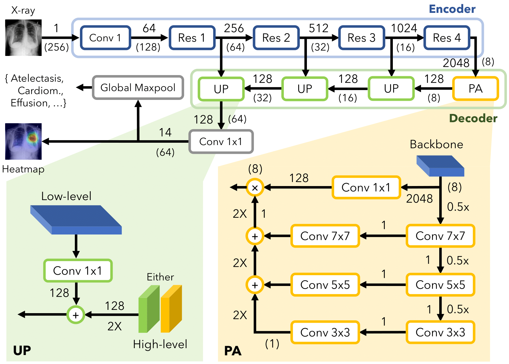

# Official implementation of Pyramid Localization Network (PYLON)

From the paper, Redesigning weakly supervised localization architectures for medical images.

**High accuracy localization:**


**PYLON's architecture:**


## What's included

- Pytorch implementation of PYLON
- Additional results
- Code to reproduce the main results

## Additional results

1. [Picked localization images](figs/picked) (~20)
2. [All localization images](figs/all) (~1000)

## Reproducing results

### Requirements

Listed in requiremnets.txt:

- Pytorch 1.4, 1.5 or 1.6
- Torchvision
- albumentations
- Segmentation models pytorch (a3cc9ac) 
- Nvidia's Apex (5d9b5cb)

You need to download the Chest X-Ray 14 dataset by yourself from https://nihcc.app.box.com/v/ChestXray-NIHCC.

Extract all the images into a single big directory `./data/images`, containing 100k images.

### Installing Segmentation models pytorch

```
git clone https://github.com/qubvel/segmentation_models.pytorch
cd segmentation_models.pytorch
git checkout a3cc9ac
pip install ./
```

### Installing Nvidia's APEX for mixed precision training

Install without C++ extensions: 

```
git clone https://github.com/NVIDIA/apex
cd apex
git checkout 5d9b5cb
pip install ./
```

### Run

The following code will run PYLON with mix-precision on Chest X-Ray dataset:

```
python train.py
```

Stats will be available at `csv/pylon/0.csv` where `0` is the seed number. 

The checkpoint will be available at `save/pylon/0/best`.

Editing `train.py` to other seeds is straightforward. 

#### Evaluation

This step loads the best model (by validation loss), then runs it against test data.

##### AUROC

```
python eval_auc.py
```

5 seeds result (not the same as in the paper):

| Atelectasis | Cardiomegaly | Effusion | Infiltration | Mass     | Nodule   | Pneumonia | Pneumothorax | Consolidation | Edema    | Emphysema | Fibrosis | Pleural_Thickening | Hernia   | micro    | macro    |
|-------------|--------------|----------|--------------|----------|----------|-----------|--------------|---------------|----------|-----------|----------|--------------------|----------|----------|----------|
| 0.780088    | 0.893228     | 0.835086 | 0.699809     | 0.833723 | 0.771837 | 0.732016  | 0.867914     | 0.752056      | 0.847234 | 0.921745  | 0.828212 | 0.785553           | 0.907488 | 0.793997 | 0.818285 |
| 0.778447    | 0.893151     | 0.832098 | 0.703097     | 0.830641 | 0.767903 | 0.731814  | 0.867936     | 0.752685      | 0.843989 | 0.924267  | 0.816795 | 0.777356           | 0.927739 | 0.793159 | 0.817708 |
| 0.776163    | 0.883426     | 0.833743 | 0.704075     | 0.832485 | 0.773034 | 0.734233  | 0.860377     | 0.752025      | 0.842728 | 0.928601  | 0.819399 | 0.786997           | 0.892397 | 0.793158 | 0.815692 |
| 0.778959    | 0.892339     | 0.833337 | 0.703168     | 0.830776 | 0.772706 | 0.730481  | 0.874188     | 0.75519       | 0.851305 | 0.924492  | 0.821411 | 0.784953           | 0.903526 | 0.795038 | 0.818345 |
| 0.776974    | 0.886909     | 0.832421 | 0.704959     | 0.833534 | 0.768914 | 0.72921   | 0.866125     | 0.75236       | 0.846948 | 0.92791   | 0.825033 | 0.777413           | 0.92615  | 0.793579 | 0.818204 |

Note: some deviations are expected.

##### Point localization

```
python eval_loc.py
```

5 seeds result (not the same as in the paper):

| Atelectasis | Cardiomegaly | Effusion    | Infiltration | Mass        | Nodule      | Pneumonia   | Pneumothorax | micro       |
|-------------|--------------|-------------|--------------|-------------|-------------|-------------|--------------|-------------|
| 0.422222222 | 0.993150685  | 0.516339869 | 0.723577236  | 0.623529412 | 0.430379747 | 0.733333333 | 0.193877551  | 0.592479675 |
| 0.544444444 | 1            | 0.549019608 | 0.707317073  | 0.705882353 | 0.481012658 | 0.758333333 | 0.193877551  | 0.633130081 |
| 0.544444444 | 0.993150685  | 0.568627451 | 0.666666667  | 0.670588235 | 0.46835443  | 0.716666667 | 0.193877551  | 0.620934959 |
| 0.527777778 | 0.993150685  | 0.529411765 | 0.674796748  | 0.682352941 | 0.455696203 | 0.725       | 0.163265306  | 0.610772358 |
| 0.516666667 | 1            | 0.529411765 | 0.74796748   | 0.682352941 | 0.493670886 | 0.741666667 | 0.163265306  | 0.62398374  |

Note: some deviations are expected. 

##### Visualizing the localization

```
python generate_heatmap.py
```

Generated heapmaps will be in `figs/picked` and `figs/all`. 